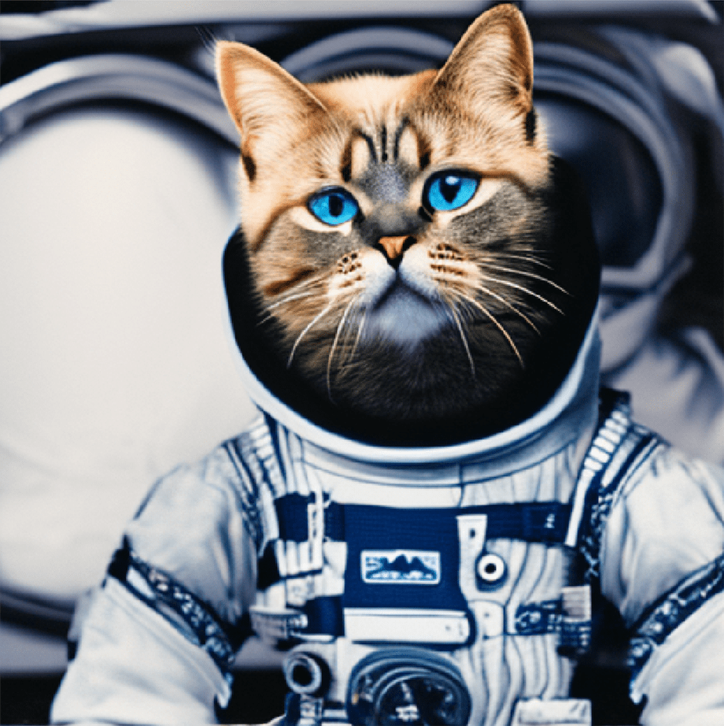
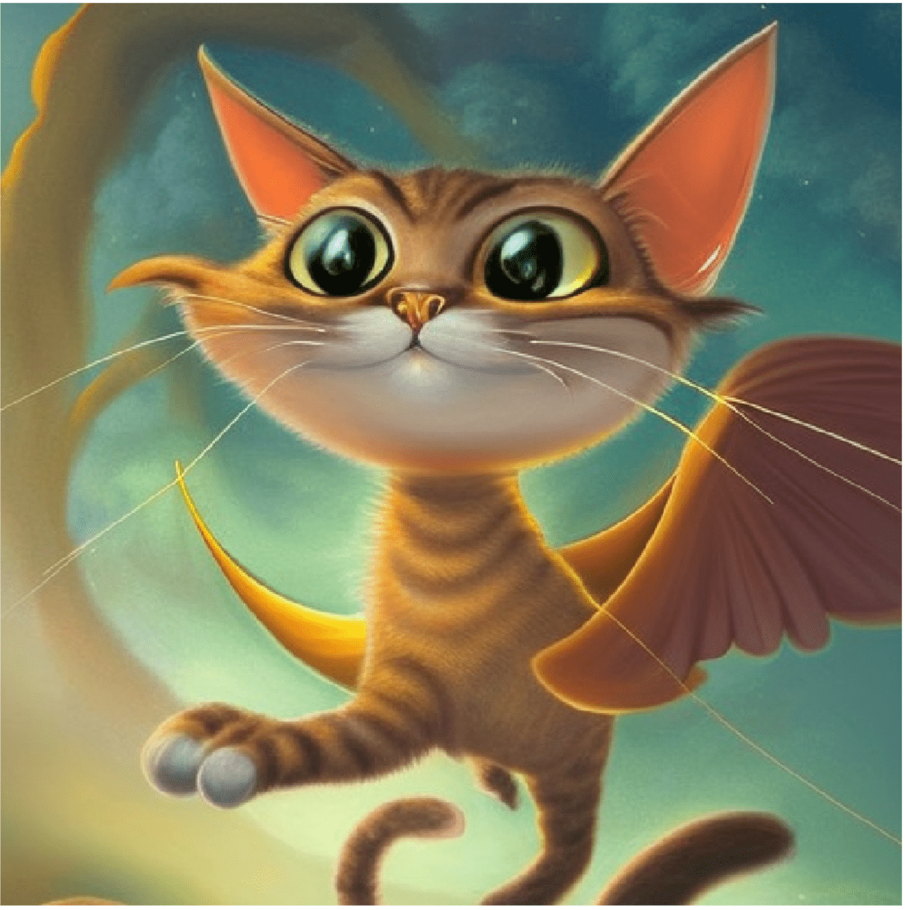
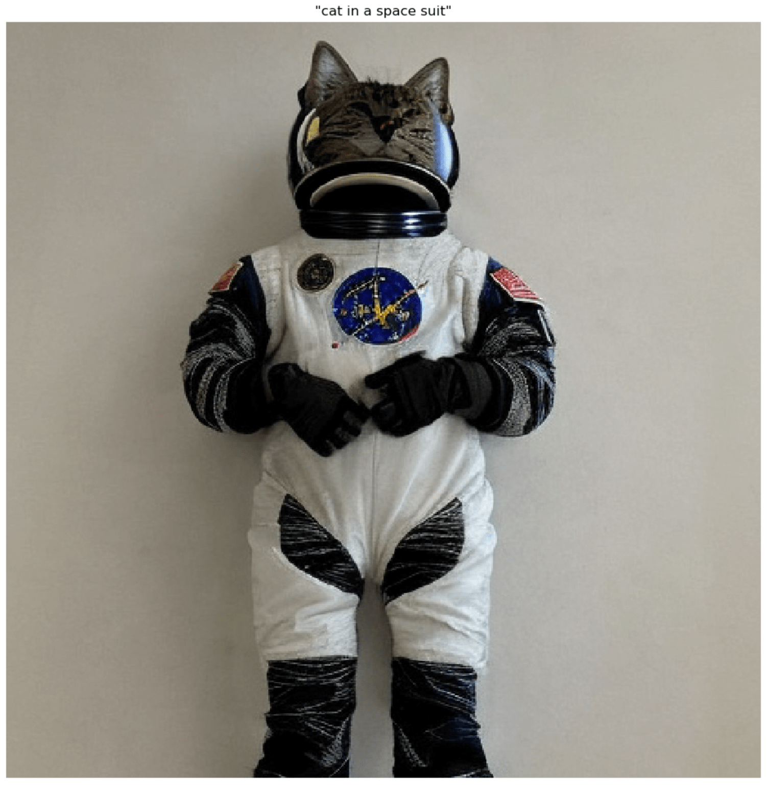
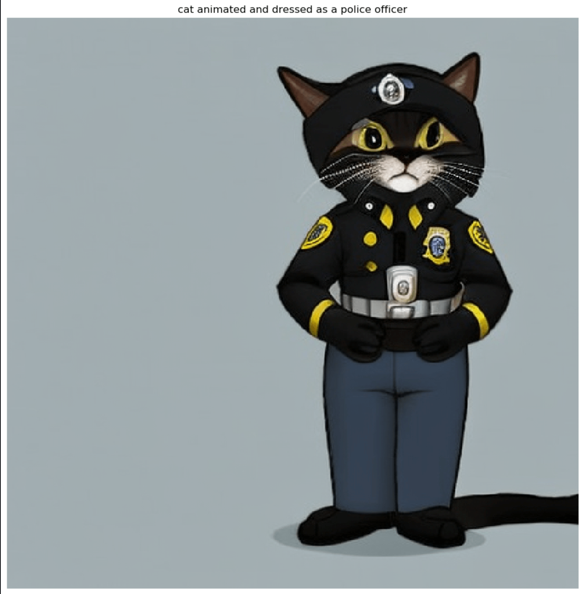

### Module 1: Stable Diffusion text-to-image model
This repository showcases the Stable Diffusion technique, a powerful generative modeling technique that allows for the creation of high-quality images from small datasets. The repository consists of three Jupyter notebooks.

The first two notebooks, `00-txt2img-jumpstart.ipynb` and `01-txt2img-gen.ipynb`, demonstrate how to easily create a SageMaker endpoint for the pre-trained Stable Diffusion model and generate cat images based on user prompts from the Jumpstart console and using python code respectively. Users can input fun scenarios and prompts to generate various cat images.

    
    

 
The third notebook, `02-finetune.ipynb`, showcases the process of fine-tuning the Stable Diffusion model with a small set of images. This approach involves using images of cats from specific breeds or your own pet cats to teach the model how to recreate these images and incorporate them into various creative scenarios. This technique can be adapted to work with any set of images containing fewer than ten examples, such as images of pet dogs or other entities.

By following the steps outlined in the notebook, you can collect a few images of your chosen entity from Google Images and utilize the fine-tuning process to train the Stable Diffusion model to create new and unique compositions. This approach offers a broad range of creative possibilities, allowing you to experiment with various scenarios and unleash your imagination.

    
    

Overall, this repository provides users with a powerful tool for generating high-quality images, even with limited datasets. The Stable Diffusion technique offers a versatile and efficient way to create customized and imaginative images.

PHOTO OWNERSHIP:
- All photos in the 01-stable-diffusion-cats/data directory belong to June Won (junghw@amazon.com) 
- All photos in the 01-stable-diffusion-cats/img/cute french bull bog puppy directory belong to Arunprasath Shankar (arunprsh@amazon.com)
- All other photos in 01-stable-diffusion-cats directory were either created using stable diffusion or are screenshots of the AWS Management Console
