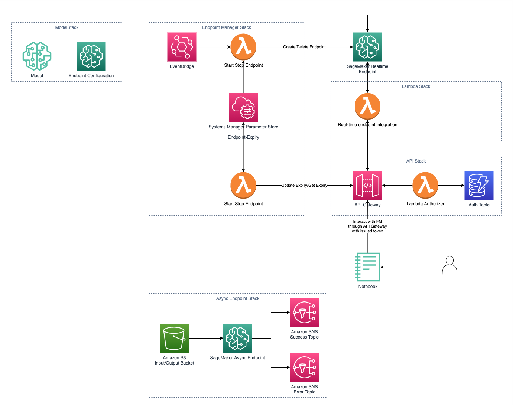

# Lab 09: Deploying an auto start/stop Amazon SageMaker Foundation Model endpoint backed by an API Gateway/Lambda

In this lab, we will walkthrough a demo on how to deploy an Amazon SageMaker foundation model fronted by a serverless API with a basic dynamodb authorizer using CDK.

In this demo we will also deploy a mechanism to manage our real-time endpoint which features an automatic start/stop functionality by setting an expiry datetime for the endpoint. Similar to a parking meter whereby you top up credits to ensure that your parking does not expire, in this case, you keep renewing the endpoint expiry date time to keep it running.

This solution was designed to solve a recurring problem with users leaving their Amazon SageMaker endpoint on and forgetting to delete them after usage. The approach taken solve this in the first iteration is to enforce users to renew their endpoint expiry times based on when they need it. By doing so, it raises the awareness of the cost of the endpoint (particularly for LLM endpoint) and also ensure that the user is intentional in how much more time they need to use the endpoint for testing.

## Table of contents
- [Lab 09: Deploying an auto start/stop Amazon SageMaker Foundation Model endpoint backed by an API Gateway/Lambda](#lab-09-deploying-an-auto-startstop-amazon-sagemaker-foundation-model-endpoint-backed-by-an-api-gatewaylambda)
  - [Table of contents](#table-of-contents)
  - [Demo Overview](#demo-overview)
  - [Lab](#lab)
  - [Deploying a real-time endpoint](#deploying-a-real-time-endpoint)
  - [Real-time Endpoint Management Functions - Querying your real-time endpoint expiry time](#real-time-endpoint-management-functions---querying-your-real-time-endpoint-expiry-time)
  - [Real-time Endpoint Management Functions - Extending your real-time endpoint expiry time](#real-time-endpoint-management-functions---extending-your-real-time-endpoint-expiry-time)
  - [Real-time Endpoint Management Functions - Adding a new real-time endpoint](#real-time-endpoint-management-functions---adding-a-new-real-time-endpoint)
  - [Interacting with your real-time endpoint via API](#interacting-with-your-real-time-endpoint-via-api)
  - [Deploying an async endpoint (WIP)](#deploying-an-async-endpoint-wip)
  - [Lab Notebook](#lab-notebook)
  - [Clean up](#clean-up)
  - [How does the endpoint manager work?](#how-does-the-endpoint-manager-work)
  - [References](#references)
## Demo Overview



---

## Lab

In this lab, we will be walking through the steps to deploying the managed Sagemaker endpoint fronted with a lambda and API gateway through the AWS Cloud9 IDE.

If you prefer to run this lab from you preferred IDE, ensure that AWS CLI and CDK has be setup correctly.

1. In your AWS account, navigate the [AWS Cloud9 service](https://us-east-1.console.aws.amazon.com/cloud9/home?region=us-east-1).
2. Create a Cloud9 environment
   - Name: sagemaker-jumpstart-example
   - Instance type: t3.small

3. Open the Cloud9 IDE
4. In the terminal, run the following cmd to clone the repository that contains the CDK stack we will be using for this lab.

    ```
    git clone https://github.com/dalacan/sagemaker-endpoint-manager.git
    ```

5. In the terminal, navigate to the stack folder

    ```
    cd sagemaker-endpoint-manager
    ```


6. Create a python virtualenv

    ```
    python3 -m venv .venv
    ```

7. Activate your virtual environment

    For Mac/Linux platform:
    ```
    source .venv/bin/activate
    ```

    If you are a Windows platform, you would activate the virtualenv like this:

    ```
    % .venv\Scripts\activate.bat
    ```
8. Install required dependencies

    ```
    pip install -r requirements.txt
    ```

9. Bootstrap your environment (if required)

    If you have not previously used CDK, bootstrap your environment

    ```
    cdk bootstrap
    ```

10. Define your configuration

    In this demo, you have the option to either deploy a FALCON 40B or FLAN-T5 model. To do so, open the `app.py` and set/uncomment the following configurations:

    For Falcon 40B
    ```
    model_name="Falcon40B"
    MODEL_ID = "huggingface-llm-falcon-40b-instruct-bf16"
    INFERENCE_INSTANCE_TYPE = "ml.g5.12xlarge"
    LAMBDA_SRC = "api/falcon"
    API_RESOURCE ="falcon"
    ```

    For FLAN
    ```
    model_name="FlanT5"
    MODEL_ID = "huggingface-text2text-flan-t5-xxl"
    INFERENCE_INSTANCE_TYPE = "ml.g5.12xlarge" 
    LAMBDA_SRC = "api/flan"
    API_RESOURCE ="flan"
    ```

11. Deploying your endpoint

    If you want to deploy a real-time endpoint, refer to [Deploying a real-time endpoint](#deploying-a-real-time-endpoint), if not refer to [Deploying an async endpoint](#deploying-an-async-endpoint)

---
## Deploying a real-time endpoint

 1. In the previous step, we defined the model we want to use. Now we will register the model and create the endpoint configurations in Amazon SageMaker. By default, the stack assumes that we will be utilising the endpoint manager to provision our real-time endpoint. This is done by setting `deploy_enable=False`.

     ```
     cdk deploy ModelMeteredStack
     ```

 2. Deploy the endpoint manager stack

     Deploy the lambda that will be responsible for the automatic creation and deletion of your Amazon SageMaker endpoint
     ```
     cdk deploy EndpointManagerStack
     ```
     
 3. Deploy serverless API

     Next we will deploy the passthrough lambda which will invoke the Amazon SageMaker endpoint and the API Gateway which will provide us with an internet facing API to interact with our Amazon SageMaker Endpoint and manage our Amazon SageMaker endpoint. The API Gateway is backed by a basic lambda authorizer with the authorization tokens stored in an Amazon DynamoDB database.

     ```
     cdk deploy ModelLambdaStack && cdk deploy APIStack
     ```

 4.  Setup your auth

     In your AWS account, you will find a Dynamodb table `auth` which stores a token (or pass code) which you will use to as an authorization token to access the APIs. Create an item in the `auth` table with an attribute `token` and set the value to your pass code which you will use when calling the API.

 Now that you have setup your environment with a real-time endpoint, let's take a look at some of the functionality this solutions has to offer.

---
## Real-time Endpoint Management Functions - Querying your real-time endpoint expiry time

When you create your endpoint for the first time, it will initialize it with the default provision time in minutes. You can check the available time left on your endpoint by either querying a specific endpoint or get a list of endpoint.

To check the time left for a specific endpoint run the following:

```
curl --location 'https://xxxxxxxxxx.execute-api.us-east-1.amazonaws.com/prod/endpoint-expiry?EndpointName=<YOUR ENDPOINT NAME>' \
--header 'Authorization: <YOUR TOKEN VALUE>'
```

Example Request:
```
curl --location 'https://xxxxxxxxxx.execute-api.us-east-1.amazonaws.com/prod/endpoint-expiry?EndpointName=demo-Falcon40B-Endpoint' \
--header 'Authorization: <YOUR TOKEN VALUE>'
```

Example Response:
```
{
    "EndpointName": "demo-Falcon40B-Endpoint",
    "EndpointExpiry ": "22-06-2023-08-24-12",
    "TimeLeft": "00:00:10.21130"
}
```

To check the time left for all endpoints configured, run the following:
```
curl --location 'https://xxxxxxxxxx.execute-api.us-east-1.amazonaws.com/prod/endpoint-expiry' \
--header 'Authorization: <YOUR TOKEN VALUE>'
```

Example Response
```
[
    {
        "EndpointName": "demo-Falcon40B-Endpoint",
        "EndpointExpiry ": "26-06-2023-12-39-47",
        "TimeLeft": "0:24:05.157431"
    },
    {
        "EndpointName": "another-ml-Endpoint",
        "EndpointExpiry ": "26-06-2023-13-15-27",
        "TimeLeft": "0:59:45.157396"
    }
]
```
---

## Real-time Endpoint Management Functions - Extending your real-time endpoint expiry time

To extend the amount of time your endpoint will be kept alive, run the following:

```
curl --location 'https://xxxxxxxxxx.execute-api.us-east-1.amazonaws.com/prod/endpoint-expiry' \
--header 'Authorization: <YOUR TOKEN VALUE>' \
--header 'Content-Type: application/json' \
--data '{
    "EndpointName": "<YOUR ENDPOINT NAME>",
    "minutes": <AMOUNT OF TIME TO EXTEND YOUR ENDPOINT>
}'
```

The following example request will extend the endpoint uptime by 10 minutes:
```
curl --location 'https://xxxxxxxxxx.execute-api.us-east-1.amazonaws.com/prod/endpoint-expiry' \
--header 'Authorization: <YOUR TOKEN VALUE>' \
--header 'Content-Type: application/json' \
--data '{
    "EndpointName": "demo-Falcon40B-Endpoint",
    "minutes": 10
}'
```

Expected Response:
```
{
    "EndpointName": "demo-Falcon40B-Endpoint",
    "EndpointExpiry ": "26-06-2023-12-39-47",
    "TimeLeft": "0:30:46.596924"
}
```
---

## Real-time Endpoint Management Functions - Adding a new real-time endpoint

With the endpoint management API, you can add a new real-time endpoint with pre-existing Amazon SageMaker endpoint configurations. 

**Note:** You can use the endpoint manager for any model regardless if it is jumpstart or not.

Run the following API call to create a new real-time endpoint:

```
curl --location 'https://xxxxxxxxxx.execute-api.us-east-1.amazonaws.com/prod/endpoint-expiry' \
--header 'Authorization: <YOUR TOKEN VALUE>' \
--header 'Content-Type: application/json' \
--data '{
    "EndpointName": "<YOUR ENDPOINT NAME>",
    "EndpointConfigName": "<YOUR ENDPOINT CONFIGURATION NAME>",
    "minutes": <PROVISION TIME IN MINUTES>
}'
```

The following API call will create a new endpoint with the name `test-inpainting-Endpoint` using the endpoint configuration `jumpstart-example-model-inpainting-cfg` with an initial uptime of 30 minutes.
```
curl --location 'https://xxxxxxxxxx.execute-api.us-east-1.amazonaws.com/prod/endpoint-expiry' \
--header 'Authorization: <YOUR TOKEN VALUE>' \
--header 'Content-Type: application/json' \
--data '{
    "EndpointName": "test-inpainting-Endpoint",
    "EndpointConfigName": "jumpstart-example-model-inpainting-cfg",
    "minutes": 30
}'
```

Example Response:
```
{
    "EndpointName": "test-inpainting-Endpoint",
    "EndpointExpiry ": "26-06-2023-13-15-27",
    "TimeLeft": 30
}
```

---
## Interacting with your real-time endpoint via API
With the deploy API Gateway and model lambda, you can interact with your Amazon SageMaker endpoint through the internet. Below are examples of how you can interact with the falcon and flan api.

**Falcon API**

Sample request to interact with the **Falcon API**:
```
curl --location 'https://xxxxxxxxxx.execute-api.us-east-1.amazonaws.com/prod/falcon' \
--header 'Authorization: <YOUR TOKEN VALUE>' \
--header 'Content-Type: application/json' \
--data '{
    "inputs": "Write a program to compute factorial in python:",
    "parameters": {"max_new_tokens": 200}
}'
```

Sample Response:
```
[
    {
        "generated_text": "\nYou can compute factorial in Python using the built-in function `math.factorial()`. Here's an example:\n\n```python\nimport math\n\nn = 5\nfactorial = math.factorial(n)\nprint(factorial)\n```\n\nThis will output `120`, which is the factorial of 5."
    }
]
```
**Flan API**

Sample request to interact with the **Flan API**:

```
curl --location 'https://xxxxxxxxxx.execute-api.us-east-1.amazonaws.com/prod/flan' \
--header 'Authorization: <YOUR TOKEN VALUE>' \
--header 'Content-Type: application/json' \
--data '{
    "text_inputs":"write a story about beautiful weather on a topical island.", 
    "max_length": 50, 
    "temperature": 0.0,
    "seed": 321
}'
```

Expected response
```
{
    "generated_texts": [
        "..."
    ]
}
```

---

## Deploying an async endpoint (WIP)

If you'd like to deploy an asynchronous foundational model endpoint, follow this step. (Note this does not have use the endpoint manager feature for auto start/stop)
```
cdk deploy ModelAsyncStack
```
---

## Lab Notebook

In this section, we will explore how we can interact with the API gateway via notebook. To get started, open the [`00-api_gateway_managed_endpoint.ipynb`](00-api_gateway_managed_endpoint.ipynb) in your notebook environment (i.e. Amazon SageMaker Studio) and run through the instructions in the notebook.

**Note:** If you're using Amazon SageMaker Studio, set your kernel image to Data Science 3.0

The notebook will show you how to manage your endpoint, interact with your SageMaker endpoint API And how to use Langchain with APIGateway.

---

## Clean up

Once you're done with this lab, you can clean up your resources by deleting the CDK stacks.

In your IDE environment, run the following command to delete the stacks.

```
cdk destory --all
```

**Note:** As the stack is not aware of any endpoint created by the endpoint manager, make sure you check that you delete any endpoint created by the endpoint manager by going to the AWS console, go to Amazon SageMaker -> Inference -> Endpoint and delete the endpoints (i.e. `demo-Falcon40B-Endpoint`)
## How does the endpoint manager work?

1. When the stack is provisioned for the first time, the user defined the initial required endpoint provision time in minutes (`initial_provision_time_minutes`) in the `app.py`
2. Once provisioned, a start/stop lambda will poll a list of Amazon SageMaker Parameter store parameter with the prefix `/sagemaker/endpoint/expiry/*` to check the expiry date/time for each endpoint. If the date/time is not expired and an endpoint has not been created, the lambda will create the model endpoint.
3. If the expiry datetime is less than the current time, the lambda will automatically delete the endpoint.
4. Users can check the time left on their endpoint by querying the `endpoint-expiry` API. For more information refer to [Real-time Endpoint Management Functions - Querying your real-time endpoint expiry time](#real-time-endpoint-management-functions---querying-your-real-time-endpoint-expiry-time).
5. Users can also extend the endpoint uptime by sending a request to the `endpoint-expiry` API by providing the time in minutes the request body. For more information, refer to [Real-time Endpoint Management Functions - Extending your real-time endpoint expiry](#real-time-endpoint-management-functions---extending-your-real-time-endpoint-expiry-time).
6. You can also add a new endpoint to be managed by the endpoint manager for pre-existing Amazon SageMaker endpoint configurations. For more information, refer to [Real-time Endpoint Management Functions - Adding a new real-time endpoint](#real-time-endpoint-management-functions---adding-a-new-real-time-endpoint).
---

## References

Building an API Gateway with CDK - https://docs.aws.amazon.com/cdk/api/v2/python/aws_cdk.aws_apigateway/README.html#lambda-based-request-authorizer
